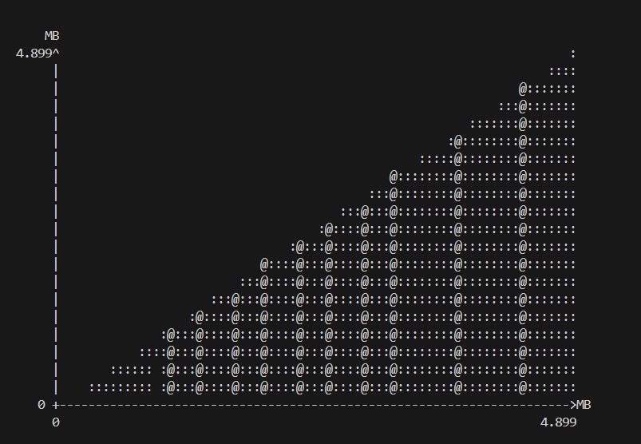

# urcu_smr

To compile the code:

```make clean```

```make```

The default data structure is linkedlist.

To run:

```./rcu_app```

To run the executable using heap profiler

```sudo apt-get install valgrind```

```valgrind --tool=massif ./rcu_app```

The output can be viewed by 
```ms_print massif.out.<processID>```

In order to run the program with preemption

    -Set the TOGGLE_PREEMPTION macro to 1 within linkedlist.c
    -Set the TOGGLE_PREEMPTION macro within main.c to 1
    -Set SLEEP_COUNT macro within linkedlist.c to 100000

In order to run the program with non-preemption

    -Set the TOGGLE_PREEMPTION macro to 0 within linkedlist.c
    -Set the TOGGLE_PREEMPTION macro within main.c to 0
    -Set SLEEP_COUNT macro within linkedlist.c to 1

In order to vary the number of threads

    -Change the THREAD_COUNT macro in main.c

In order to change the duration of the program

    -Change PROGRAM_DURATION macro in main.c

To change number of writer threads

    -Change the WRITER_THREADS macro in main.c

After running the ms_print command the output will look like this:
